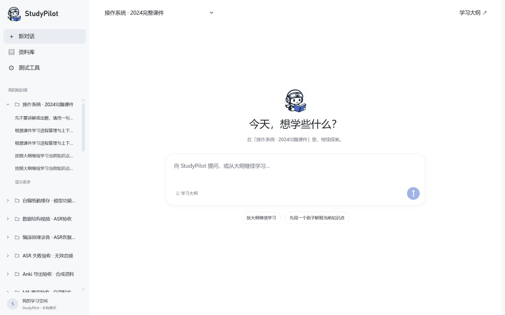
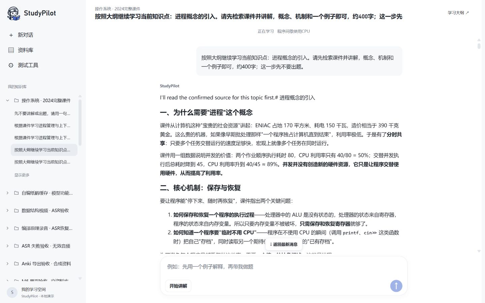
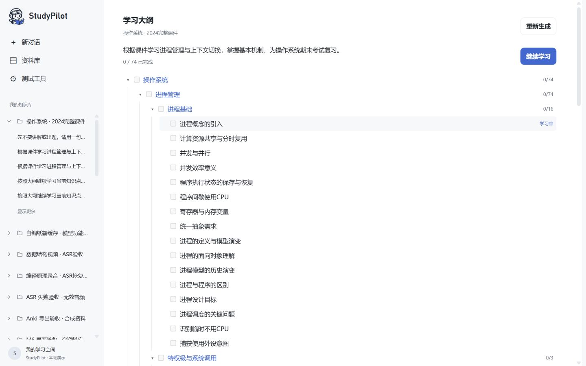
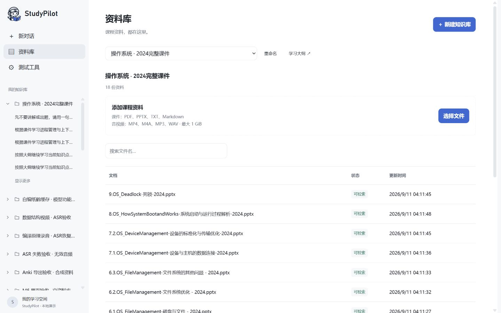

<div align="center">
  
  <h1>StudyPilot</h1>
  <p><strong>从课程资料到学习大纲，再到对话、测验与复习卡。</strong></p>
  <p>AgentScope · Spring Boot · MySQL · Redis · RocketMQ · Elasticsearch · RustFS<br />React · TypeScript · Vite</p>
</div>

StudyPilot 是面向课程学习与期末备考的 AI 学习助手。上传课件与习题后，按资料生成分层大纲；围绕知识点与 Agent 对话，通过讲解、练习、错题答疑和复习卡串联学习过程。

这是面向**桌面浏览器的个人演示项目**。截图来自实际运行页面；课程和聊天记录属于本地演示数据，不随仓库提供。

[界面展示](#界面展示) · [核心设计](#核心设计) · [本地运行](#本地运行) · [实验记录](#实验记录) · [演示站部署](deploy/demo/README.md)

## 界面展示

### 按知识库组织对话

知识库像项目一样收纳历史聊天，按最近更新时间排列。新聊天复用当前知识库大纲，拥有独立的消息、练习、卡片和上下文。



### 连续学习对话

消息区独立滚动，输入框固定在底部。Agent 可以检索资料、回答追问并通过工具推进阶段；工具调用默认折叠，选择题与卡片直接在对话中操作。



### 分层学习大纲

课件知识点先提取、再合并成多层待办目录，叶子节点对应学习任务。选入习题参考时，结合习题标注重点；同一大纲的已完成节点跨关联聊天汇总。



> 图中大纲由 18 份操作系统课件和 2023–2024、2024–2025 两份考试回忆生成，展示页面置换章节的重点标签。当前生成结果仍存在同义节点重复，重点映射也可能遗漏；未标记不代表不重要。

### 资料库管理

集中管理知识库、上传课程资料、搜索文件名并查看处理状态。支持 PDF、PPTX、TXT、Markdown，以及通过本地转写服务处理音视频。



## 核心设计

### 学习 Agent 与状态管理

- **规划：** 复用已解析的课件文本，按文档分批提取知识点、合并分层大纲；可选习题映射与重点标注。
- **学习：** 讲解与追问 → 选择题 → 交卷与错题答疑 → 卡片草稿 → 用户确认 → 下一个知识点。阶段转换与写入限制由服务端工具控制，单次题目和卡片各最多 10 个。
- **复习：** 卡片可以编辑或要求重写，确认后可通过 AnkiConnect 导出到本机 Anki。
- **流式与观测：** SSE 推送模型输出及工具事件；traceId 关联模型调用、工具执行和业务状态，便于定位失败步骤。

重点标注属于大纲生成流程：`POST /api/learning/plans` 中分别传入 `lessonDocumentIds` 与 `exerciseDocumentIds`，再调用 `POST /api/learning/plans/{runId}/execute` 执行。通过 `GET /api/learning/plans/current?knowledgeBaseId=...` 读取当前大纲。失败后可对原任务再次执行，复用成功阶段；目前没有仅给已有大纲追加重点的独立接口。

整门课按“分批提取 → 合并大纲 → 定位习题考点 → 引用原文匹配与复核 → 分批安排任务”处理。模型选择摘录编号，由服务端回填原文，避免抄写公式和 Markdown 时破坏引用。重点是依据已选习题给出的复习建议，不是未来考试预测。

### 上下文压缩

在阈值压缩之外，利用知识点边界做局部摘要：进入写卡阶段时，异步总结该知识点的学习对话；编辑、重写卡片期间继续使用原上下文。全部卡片确认后，才用摘要替换该知识点记录，并丢弃卡片阶段的对话。摘要与业务状态持久化，支持会话恢复。

摘要属于有损压缩，主要面向按大纲继续学习的场景，不保证保留此前对话的全部细节。

### 跨会话学习记忆

用户可以在“学习记忆”页填写讲解偏好和长期目标。提交测验时，保存知识点、当次答题结果与错题题干；新的学习聊天只读取当前用户和知识库的历史记录，优先同名知识点，再按最近时间选择，限制条数与 token。记忆可以关闭，单条记录可以排除或重新纳入，不删除原聊天。

这部分复用结构化评分，没有额外画像模型调用，也不把一次测验成绩视作稳定掌握度。详情与面试说明见 [学习记忆](docs/implementation/learning-memory.md)。

### 口令保护的在线演示

[部署目录](deploy/demo/README.md) 提供独立 Compose、HTTPS 访问口令和 SSE 代理配置，内部服务不开放公网端口，模型 Key 仅注入后端。在线版为共享演示空间，卡片确认后保存在站内；音视频转写和本机 Anki 导出保留在本地版。配置已准备，尚未公开上线或完成云端启动。

### 资料处理与 RAG

```text
文件分片上传 → RustFS 原文件 → RocketMQ 异步处理
                              ↓
                       解析 / 音视频转写
                              ↓
                  保存解析文本 → 切块 → 向量化
                              ↓
                         Elasticsearch
                              ↓
                   Agent 检索工具 → 带来源的讲解
```

- Redis Bitmap 记录已上传分片，支持断点续传；SHA-256 与唯一索引用于文件去重及并发重复写入控制。
- 文档阶段状态、中间产物复用、幂等写入与重试支持处理任务恢复，减少重复解析和向量化。
- 原文件与解析 TXT 保存在 RustFS，文本块与向量复用产物保存在 MySQL，Elasticsearch 承担检索。
- 检索支持关键词、向量及 RRF 混合方案；父块回填作为上下文组装的独立对照。当前代码默认仍是 PARENT（RRF＋父块回填），并未切换为纯向量；策略实验的结论与运行默认值需分别说明。

普通检索、Agent 检索、Trace、评测和 Hello 诊断集中在独立的**测试工具**页面。评测接口需要启用 `eval` profile；未启用时页面明确提示不可用。

## 本地运行

### 环境

- JDK 21、Maven 3.9+、Node.js 22 LTS 与 npm。
- Docker Desktop，用于运行中间件。
- 可用的 DeepSeek 与阿里云百炼 API Key。
- 可选：Anki + AnkiConnect；Python、本地 faster-whisper 模型与转写 worker。

**前后端在本机运行，Docker 只运行中间件。** IDEA 修改代码后重新运行即可，不需要同步源码到容器。当前默认配置名为 `local`，复用项目已有演示数据库 `study_agent_eval`；`eval` 不是模拟模型。

### 1. 启动中间件

在仓库根目录执行：

```powershell
docker compose up -d mysql redis elasticsearch rustfs rocketmq-namesrv rocketmq-broker
```

按当前 broker 配置，在本机 hosts 中添加以下映射（Windows 文件位置：`C:\Windows\System32\drivers\etc\hosts`，编辑需要管理员权限）：

```text
127.0.0.1 rocketmq-broker
```

**首次使用空数据卷时**，Compose 创建的是 `study_agent`，还需为默认 `local` 配置创建演示库并授权：

```powershell
docker exec -it study-agent-mysql mysql -uroot -p -e "CREATE DATABASE IF NOT EXISTS study_agent_eval CHARACTER SET utf8mb4 COLLATE utf8mb4_0900_ai_ci; GRANT ALL PRIVILEGES ON study_agent_eval.* TO 'study'@'%';"
```

按提示输入 Compose 中配置的本地 MySQL root 密码。后端启动时由 Flyway 创建表结构，初始化 Elasticsearch 索引与对象存储 bucket。已有数据库无需重复初始化或清空。

### 2. 配置模型并启动后端

PowerShell 示例，在**同一个终端**设置自己的密钥后启动：

```powershell
$env:DEEPSEEK_API_KEY = '你的 DeepSeek API Key'
$env:AI_DASHSCOPE_API_KEY = '你的百炼 API Key'
mvn spring-boot:run
```

IDEA：导入根目录 `pom.xml`，使用 JDK 21，工作目录设为仓库根目录，在运行配置中设置上述环境变量，启动 `com.studyagent.StudyAgentApplication`。默认 profile 为 `local`。

模型名称与服务地址分别见 [基础配置](src/main/resources/application.yml)、[演示配置](src/main/resources/application-eval.yml) 和 [本机配置](src/main/resources/application-local.yml)。当前演示配置使用 `deepseek-v4-flash`、`qwen3.7-text-embedding`、1024 维向量；需确保账号能够访问对应模型。更换 embedding 模型或维度时，应使用新索引并重建向量。

也支持根目录 `some_apiKey` properties 文件，该文件已被 Git 忽略。不要把实际密钥写入 README 或提交到仓库。

### 3. 启动前端

另开终端：

```powershell
cd frontend
npm ci
npm run dev
```

打开 **http://localhost:5173**。Vite 将 `/api` 代理到本机后端 8080。

| 服务 | 本机端口 |
| --- | --- |
| 前端 / 后端 | 5173 / 8080 |
| MySQL / Redis / Elasticsearch | 3307 / 6380 / 9200 |
| RustFS S3 / 管理页 | 9000 / 9001 |
| RocketMQ nameserver / broker | 9876 / 10911 |
| 可选 ASR worker / AnkiConnect | 8767 / 8765 |

### 4. 走一遍学习流程

1. 在「资料库」创建知识库，上传课件，等待状态变为「可检索」。
2. 进入「学习大纲」，选择用于生成目录的**课件**；若有往年题，将对应文档选为**习题参考**。文件名不会自动决定用途。
3. 生成大纲后，从「新对话」开始学习；后续新聊天可继续使用这份大纲。
4. 通过对话追问、进入测验、提交选项，再生成和确认复习卡。
5. 需要导出时，打开装有 AnkiConnect 的本机 Anki。

音视频上传后需要启动 [本地 ASR worker](scripts/local-asr-worker.py)，其依赖见 [requirements-asr.txt](scripts/requirements-asr.txt)；启动时传入本地模型目录和缓存目录。仅演示课件学习无需启动 ASR。

## 实验记录

实验调用真实后端 API。以下是指定资料和脚本下的结果，不代表线上效果或所有课程的表现。

| 实验 | 范围 | 结果 |
| --- | --- | --- |
| 知识点摘要 | 同一份 OS 大纲，5 个知识点、31 个用户回合；对比不压缩 | 累计输入 token 从 1,041,780 降至 390,101，减少 **62.55%**，包含摘要调用 |
| 检索策略 | 18 份 OS 课件、28 道用户编写并提供参考页的问题，Top 5 | BM25 命中 26/28，向量与 RRF 均 27/28 |

检索按“存在实质答案依据”判读，允许部分依据，由 Codex 对照参考页检查，并非独立人工黄金标注或回答准确率。父块回填在 4096 预算下为 25/28，8192 下恢复至 27/28，不能据此宣称优于子块。压缩实验是单组工作流对照，模型输出和工具调用次数并非完全一致，也不能将输入 token 降幅当成费用降幅。

- [上下文压缩实验：流程、计数与限制](docs/implementation/current-learning-compaction.md)
- [OS 28 题检索与父块预算对照](docs/implementation/os-rag-human-28.md)

## 代码导航

项目是模块化单体，先理解三条业务链即可：

```text
资料入库：上传 → 解析/转写 → 切块/向量化 → 索引
大纲生成：已解析课件 → 知识点提取 → 合并目录 → 习题标重点
对话学习：复用大纲 → 讲解/追问 → 测验/答疑 → 卡片确认 → 摘要/下一点
```

RAG 为学习提供资料，记忆服务提供历史观察，Anki 承接复习卡。完整结构图、状态图和“LRU”数据流例子见下面的架构链接。

| 目录 | 职责 |
| --- | --- |
| `frontend/src/` | 页面、聊天渲染、SSE 与上传交互 |
| `src/main/java/com/studyagent/learning/`、`agent/` | 大纲编排、学习状态、Agent 与上下文 |
| `src/main/java/com/studyagent/ingest/` | 上传、解析、存储与异步处理 |
| `src/main/java/com/studyagent/rag/`、`algo/` | 检索、索引、切块和融合算法 |
| `src/main/java/com/studyagent/review/` | 复习卡与 Anki 导出 |
| `src/main/resources/db/migration/` | Flyway 表结构迁移 |
| `eval/`、`scripts/` | 实验样本、结果和执行脚本 |

进一步阅读：[整体架构与三条主链路](docs/design/StudyAgent-技术设计方案.md) · [文档导航](docs/README.md) · [脚本导航](scripts/README.md) · [当前进展](PROGRESS.md)

## 当前边界

- 当前面向本机演示，前端使用固定演示用户；不作为已完成登录鉴权、可直接公网部署的产品。
- 新聊天共享大纲及关联节点完成情况；旧会话不补迁移历史进度，重新生成大纲不迁移正在进行的练习和卡片。
- 本仓库不附带个人 API Key、下载的课程原件、本地模型权重或演示数据库。请使用自己有权使用的资料。
- 日常开发只检查受影响部分。真实模型实验会产生调用费用，不作为每次构建的默认步骤。
