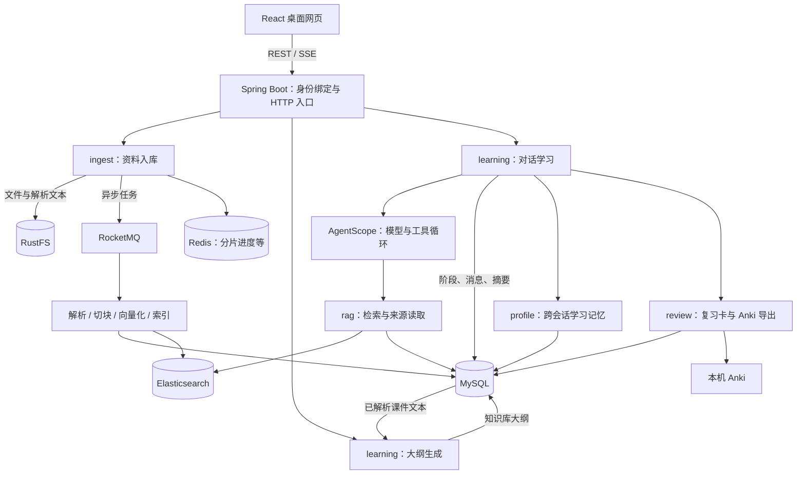
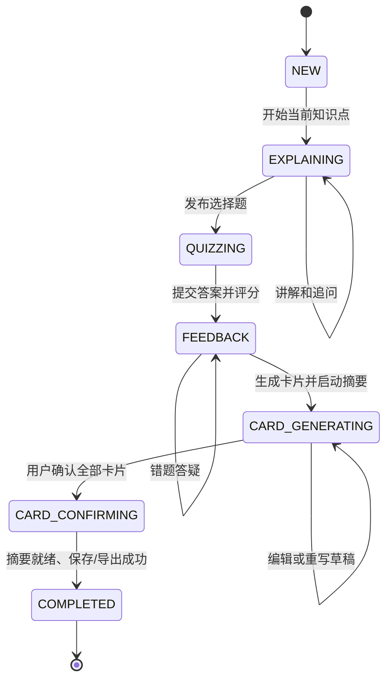

# StudyPilot 当前架构与核心链路

更新于 2026-09-22。本文描述当前代码，取代早期固定五题三卡、同步按钮式学习的设计。产品范围见 [001](001-全局设计与范围.md)，运行方式见 [README](../../README.md)，待办只维护在 [PROGRESS](../../PROGRESS.md)。

## 1. 整体结构

这是一个 **React 桌面网页 + Spring Boot 模块化单体**。Java 业务运行在同一个进程中；MySQL、Redis、RocketMQ、Elasticsearch、RustFS 是外部基础设施，不是五个业务微服务。



`config/` 集中装配与配置；`model/`、`mapper/` 放数据库实体和查询；`algo/` 放切块、RRF 等纯算法；实验指标由 Python 评测脚本计算。无需再为这些目录各建一套接口层。

## 2. 三条核心链路

### A. 资料入库：文件如何变成可检索资料

```text
分片上传 → RustFS 合并文件 → MySQL 保存文档 → RocketMQ 通知
  → 解析课件 / 转写音视频 → 保存解析文本 → 父子切块
  → 子块 embedding → Elasticsearch 索引 → 文档 INDEXED
```

- `FileUploadService` 是上传入口，`NativeMultipartUploadService` 管分片，`UploadPublicationService` 发布文档。
- `DocumentIndexConsumer → DocumentPipeline` 驱动处理阶段。当前是一条 MQ 消息驱动管道，不是每个阶段一个队列。
- 原件和解析文本保存在 RustFS；文本块、处理状态、可复用向量产物保存在 MySQL；ES 是用于搜索的索引副本。
- 规划复用 MySQL 已解析的父块正文，聊天搜索使用 ES。不是每次聊天重新解析、切块、向量化。
- SHA-256/唯一键解决重复文件写入；Redis Bitmap 记录分片进度；阶段产物复用减少失败后的重复处理。
- 消息在事务提交后发送，未实现事务 outbox；`DocumentRecoveryJob` 补发待处理或过期任务。任务租约、幂等和失败状态属于当前链路所需能力。

### B. 生成大纲：整份资料如何形成学习路径

```text
选课件 + 可选往年题
  → 分批提取课件知识点（EXTRACT）
  → 合并递归目录（OUTLINE）
  → 可选考点定位、原文匹配和复核（EMPHASIS_*）
  → 分批生成叶子任务（TASK_BATCH）→ 服务端汇总（TASKS）
  → 保存知识库大纲
```

- 入口：`LearningPlanningController → LearningPlanningService`。
- 读取选中文档的全部可用父块，再分批处理；这一过程不使用 RAG Top K 来代表整门课。
- `PlanningModel` 管模型调用，`PlanningOutline/Validation/Evidence` 管目录结构、来源匹配和结果约束，`PlanningPersistence` 保存阶段及失败位置。
- 大纲是多层树，叶子才是学习任务；重点是 HIGH/MEDIUM/NORMAL 标签。不是每次新聊天都生成大纲。
- `POST /api/learning/plans` 创建任务；`POST /plans/{id}/execute` 执行；`GET /plans/current?knowledgeBaseId=...` 读取当前大纲。
- `POST /plans/{id}/session?newConversation=true` 基于大纲创建独立聊天。没有参数则继续该大纲最近关联的会话。

### C. 对话学习：模型如何参与、服务端如何约束

```text
用户消息 → 认领回合并恢复上下文 → 构建本轮 Agent
  → 模型回答 / 调用资料工具 / 请求学习阶段转换
  → 服务端检查状态和产物 → 事务保存 → 保存上下文 → SSE 返回
```

- `LearningConversationService` 编排一轮处理。
- `LearningConversationGateway` 构建本轮 ReActAgent，注入大纲、学习状态、上下文及学习记忆；通过 `LearningSourceTool/LearningActionTool` 提供本阶段允许的工具。
- `LearningTurnPersistence` 负责回合认领、幂等和产物提交；`LearningPersistenceService` 保存测验、知识点状态等业务事实。
- 网页走 `POST /sessions/{id}/messages/stream`。同步 `/messages` 供脚本使用；结构化 `/quiz/submit` 将选项转成同一条对话链路，不另建评分流程。
- 模型提出动作，服务端决定动作是否合法。题目和卡片数量均为 1–10，工具参数和产物校验共同限制。
- 学习流程是“大纲生成工作流 + 受状态约束的 ReAct 对话”，不是通用的 Plan-and-Execute Agent。



评分是依据题目保存的标准选项进行确定性判分；题目和标准答案来自模型，不能因此保证题目内容永远正确。确认失败时保留明确状态，用户可重试，不将失败当成完成。

## 3. 用“操作系统 → LRU”贯穿数据变化

| 用户动作 | 服务端做什么 | 数据发生什么变化 |
| --- | --- | --- |
| 上传 OS 课件和往年题 | 保存文件、解析、切块、向量化 | 新增 `documents/document_chunks`，原件/TXT 入 RustFS，子块向量入 ES |
| 生成大纲 | 遍历课件，合并章节，结合往年题标重点 | `learning_plan_runs/stages` 保存大纲和阶段输出，其中有 LRU 叶子节点 |
| 新建聊天 A | 从该大纲创建独立学习实例 | 新增 `learning_sessions`、计划快照 `learning_plans`、会话内 `knowledge_points`；以 `plan_run_id/outline_node_id` 关联共享目录 |
| 问“LRU 为什么不出现 Belady 现象？” | 恢复聊天 A 上下文；按需检索、读取来源 | 新增 `learning_turns`，保存回答与工具轨迹；知识点仍在讲解阶段 |
| 答完选择题 | 按已生成选项判分，进入错题答疑 | 写 `quizzes` 的答案/分数/反馈，同时写一条 `learning_memories` 测验观察 |
| 生成卡片并重写 | 保存草稿，同时总结写卡前的 LRU 对话 | `review_cards` 为草稿；`learning_contexts` 保存待应用摘要，仍使用原上下文 |
| 确认全部卡片 | 本地导出 Anki；demo 模式只保存站内卡片；应用摘要 | LRU 标 COMPLETED，当前点原上下文被摘要替换；卡片讨论丢弃，完整聊天历史仍在 `learning_turns` |
| 新建聊天 B | 复用大纲，汇总该大纲已完成叶子，读取可用历史观察 | 独立消息/测验/卡片；新聊天跳过已完成叶子，不复制聊天 A 全部上下文 |

共享的是大纲及其完成记录的汇总，聊天中的在途练习、草稿和上下文各自独立。重新生成大纲不会悄悄重写正在进行的聊天路径。

## 4. 两种记忆，两个不同目的

| 机制 | 保存在哪里 | 什么时候读取 | 作用 |
| --- | --- | --- | --- |
| 当前聊天上下文、知识点摘要 | `learning_contexts`，压缩记录在 `learning_compactions` | 同一聊天下一轮 | 控制上下文长度、恢复会话 |
| 跨聊天学习记忆 | `learning_preferences/learning_memories` | 当前用户、当前知识库的其他聊天 | 带入讲解偏好、目标和历史错题观察 |

写卡前异步生成摘要，卡片确认前仍使用完整原上下文；确认后才替换当前知识点片段。摘要有损，完整历史记录不等于每轮都送给模型。

长期记忆复用评分结果，不再调用模型提取“人格画像”。当前按同名知识点优先、最近时间其次，最多 4 条、正文预算 1200 token；不采用向量记忆库，也不把一次错误认定为长期弱项。可在界面关闭或排除单条记忆。

## 5. RAG 内部结构与实际查询步骤

```text
knowledge_search(query)
  → 服务端绑定 userId + knowledgeBaseId
  → 查询向量（BM25 模式不需要）
  → ES 子块候选：BM25 / Vector / 两路召回
  → RRF 按排名融合（选用混合时）
  → Top K 子块
  → 直接使用子块 或 按 parentChunkId 回填并去重
  → 按正文 token 预算装入上下文 + 来源标识
```

| 选择 | 改变哪一层 | 取舍 |
| --- | --- | --- |
| BM25 | 召回与排序 | 精确术语有用，容易漏掉不同表述；无需查询 embedding |
| VECTOR | 召回与排序 | 适合语义改写，仍可能漏掉精确标识 |
| RRF | 合并 BM25 与向量的排名 | 无需归一化两种分数，但另一条路线不提供新证据时未必提升 |
| PARENT | 当前实现先 RRF，再回填父块 | 邻近内容更完整，也更占预算；过大整块会跳过，可能丢掉有用证据 |

**当前代码默认是 PARENT，而不是此前简历讨论中的 VECTOR。** 本轮只整理，不改变检索策略。默认 Top K=6、两路各 30 候选、RRF k=60、正文预算 4096；本机配置覆盖为子块 800/overlap 0、父块 2400/overlap 0。索引使用 1024 维 cosine 向量。参数以生效 profile 为准。

`compareContexts` 复用同一份 RRF 子块排名，只改变上下文组装，适合比较回填效果。召回命中和最终上下文包含答案是两项不同结果；实验记录见 [OS 28 题](../implementation/os-rag-human-28.md)。

Agent 也可以用 `knowledge_read` 直接读取已知来源，不要求每轮重新搜索。提供出处只保证可定位资料，不等于已经自动判定回答正确。

## 6. 从职责定位代码，不必逐个类读

| 想了解什么 | 从哪里开始 | 再看什么 |
| --- | --- | --- |
| 页面如何组织 | `frontend/src/App.tsx` | Sidebar、LearningPanel、LearningOutline、DocumentPanel、LearningMemoryPage、TestTools |
| 上传到索引 | `ingest/upload/FileUploadService` | NativeMultipartUploadService → UploadPublicationService → DocumentPipeline |
| 大纲怎么生成 | `learning/LearningPlanningService` | PlanningModel、PlanningOutline、PlanningValidation、PlanningPersistence |
| 一轮聊天 | `learning/LearningConversationService` | Gateway → 工具 → TurnPersistence |
| 卡片与摘要交接 | `learning/LearningCardStageService` | ConversationCompactor、AnkiExportService |
| 检索对照 | `rag/retrieval/KnowledgeRetrievalService` | RetrievalService、BM25Retriever、VectorRetriever、ParentAggregator |
| 历史记忆 | `profile/LearningMemoryService` | LearningMemoryMapper、LearningMemoryController |
| 请求和工具轨迹 | `learning/LearningTraceService` | ObservedModel、ModelUsageRecorder、LearningTraceController |

`agent/` 提供通用模型、工具 scope 和诊断集成；学习业务编排在 `learning/`。Hello 诊断所用 HarnessAgent 不等于主学习 Agent，主学习流程在 Gateway 内构建 ReActAgent。

### 为什么会有近 200 个 Java 文件

2026-09-22 清理后，`src/main/java` 共 199 个 Java 文件，约 1.1 万行，包含空行和注释；不含 74 个测试文件或 19 份 Flyway 迁移。

| 分类 | 文件数 | 文件存在的原因 |
| --- | --- | --- |
| 学习 `learning` | 40 | 大纲、聊天、状态、摘要、工具、HTTP 与数据类型 |
| 摄入 `ingest` | 28 | 分片上传、对象存储、解析、MQ、管道与 HTTP |
| 检索 `rag` | 21 | embedding、ES、召回/组装、知识库/来源 HTTP |
| 配置 `config` | 31 | 连接各外部服务、配置参数和 Spring Bean 装配 |
| 实体/Mapper | 39 | 20 个数据实体与 19 个数据库访问接口 |
| 其他 | 40 | Agent 集成、算法、身份、卡片、记忆、评测、公共响应和入口 |

其中 128 个文件不超过 50 行。小文件不等于废弃代码：例如 Mapper 经 MyBatis 创建代理，Controller 由 Spring 路由调用，不能只凭“没有显式 new”删除。`ingest/web`、`ingest/parse`、`ingest/storage` 是职责分包，不是三个额外产品功能。

这套拆分对个人 demo 偏细；已有上传恢复、音视频、Anki、长期记忆与评测设施，也确实增加了代码量。后续应按以下依据收敛，而不是规定必须砍到某个文件数：

- 没有调用且已被替代的兼容层/工具直接删除。本次又删除 `TextChunker`、`JsonPayloadReader`、仅由自身测试引用的 `RecallMetricCalculator`。
- 仅供一个入口使用的简单请求/响应类型，可在修改该入口时内聚；不为机械减少文件数改遍全仓引用。
- 业务状态、外部服务适配、必要事务边界保留，避免所有逻辑重新堆进一个大 Service。
- Hello、评测、Canal 等辅助设施与主链路分别说明；条件启用不等于完全没有用途，不按无用代码直接删除。

## 7. 运行与辅助内容的边界

- **日常本地运行：** Windows/IDEA 后端 + 本机 Vite；Docker 运行数据库、MQ、对象存储和 ES。`local` profile 复用 `application-eval.yml` 的演示配置，名称不代表使用假模型。
- **在线演示：** `deploy/demo/` 是独立的全容器部署配置，口令保护、共享用户。尚未上线，不能把准备了配置写成已经部署。
- **可选集成：** 音视频需要本地 ASR worker；本地确认卡片需要 AnkiConnect。Canal 在 local/eval/demo 关闭，保留为可选历史同步方式，不是当前必需链路。
- **测试工具：** 普通检索、Agent 检索、Trace、评测、Hello 是独立页面。`eval/`、实验脚本、`docs/evidence/` 不参与产品运行，但保留简历指标的样本与来源。
- **数据库迁移：** 历史 Flyway 文件仍须保留，不能因为旧代码删除就删除已应用迁移。

## 8. 清理后的边界与仍存在的问题

已删除无业务调用的 FSRS、未注册的旧写卡工具及只服务它的截断中间件；删除根据一句目标临时生成 3–5 点计划的旧入口，以及 explain/quiz/cards 快捷接口。学习会话统一由资料大纲创建，读接口直接组装持久化事实，不再依赖旧流程服务。

保留结构化交卷接口，因当前压缩实验仍使用它；它也走正式对话链路。没有重建数据库、迁移聊天数据、改动模型或重跑历史实验。

仍需分开看待：大纲同义节点重复是内容质量问题；默认 PARENT 与期望 VECTOR 的差异是策略选择；Canal 和旧实验启动脚本是可选历史设施。它们不应混成一次全仓重写。当前代码仍有较大的编排类和重复状态读取，但本轮不为缩短文件而增加抽象层。
