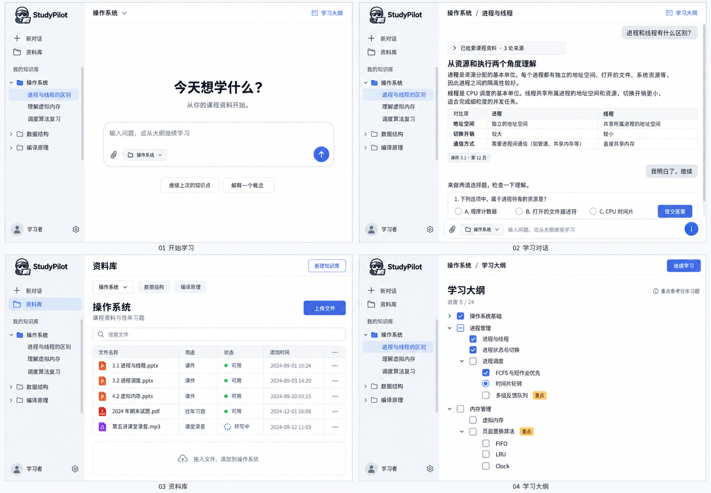

# StudyPilot 对话式界面提案

2026-09-14。概念稿经用户确认后已实施为桌面对话界面；以下 PNG 保留为设计参考。运行页面使用统一浅灰侧栏、白色内容区、蓝色强调色和简化 SVG 标志。

实施包含知识库分组历史聊天、新对话、资料库管理、学习大纲、独立测试工具页。新聊天复用知识库大纲并建立独立消息与产物；大纲节点完成情况跨关联聊天汇总。旧聊天不补迁移历史进度，重新生成大纲也不会迁移正在进行的练习和卡片。

## 页面组织

- 全局左侧栏：左上角标志与 StudyPilot 字标，下方“新对话”“资料库”“测试工具”，再按知识库分组。知识库可展开最近会话，会话按最近更新时间倒序；点击恢复，不要求输入编号。
- 开始学习：选定知识库后展示居中的输入框，可以从当前大纲继续。新会话不重复生成大纲。概念图此处误保留历史会话选中态，实施时新对话应取消该选中态。
- 学习对话：顶部显示知识库和会话标题，右侧进入学习大纲；中央连续正文，用户消息靠右，助手回复不整段包卡片。工具执行使用独立默认折叠区块；选择题和复习卡作为对话内产物。底部输入固定，消息区独立滚动，向上阅读时不强制拉回底部。
- 资料库管理：同一全局侧栏，主区提供知识库选择、新建知识库、文件搜索、上传和处理状态。用途在大纲生成表单中选择。库选择的最终控件统一为一个选择器，不照图同时堆叠选择器与少数库标签；已有解析产物继续复用。
- 学习大纲：当前知识库的一份大纲，使用可展开的多层待办树，展示完成、部分完成和当前知识点；重点只用短标记，不展示依据卡片。完成框表示业务状态，不允许仅靠点击视觉勾选推进学习阶段。

## 视觉与范围

参考用户提供的 ChatGPT、DeepSeek、Gemini 截图：浅灰侧栏、白色主区、深灰正文、少量蓝色动作强调；中文无衬线，消息最大阅读宽度约740px。桌面全视口布局，品牌和用户入口固定，侧栏列表与主区各自滚动；不新增窄屏适配工作。

示意色：主区 #FFFFFF、侧栏 #F7F8FA、正文 #20242B、强调 #4267CF、边线 #E3E6EB、重点 #B78024。以上为候选视觉参数，确认并实施时再同步 DESIGN.md 与共享 CSS，避免文档提前宣称已迁移。

图中的文件、消息、日期、题目与进度用于展示排版，不是运行结果或新增产品要求。课程内容在真实界面中仍来自后端。图像中的题目选项无需照抄。

## 标志概念

参考用户指定的[Copilot 飞行员形象](https://brand.github.com/brand-identity/copilot)，生成不同轮廓的护目镜飞行员，前方偏右持展开的书。独立稿使用深墨色与蓝色书封；后续实施可据确认稿整理透明底资源及小尺寸简化图标。当前四屏稿内嵌图标与独立稿存在细节差异，实施统一使用最终确认标志。

## 后续实施顺序

1. 共享外壳与导航：品牌、知识库会话树、独立滚动。
2. 新对话和学习聊天：正文、工具区块、固定输入区、练习和卡片。
3. 资料库文件管理与多层学习大纲。
4. 将检索与开发诊断集中到独立测试工具页。

以用户需要的学习流程为准，不要求复刻旧页面或给每个 API 配一个按钮。以下为代码阅读后的取舍建议，尚未实施。

## 功能取舍与接口适配（2026-09-14）

结论：四屏布局可以承载核心业务，但概念图不等于功能已经覆盖；尤其“共用大纲的新聊天”存在后端语义缺口。旧入口可以合并或取消，必要业务动作和真实失败状态仍需有落点。

| 业务能力 | 新设计中的落点与取舍 | 当前接口 / 实现 |
| --- | --- | --- |
| 创建、选择、重命名知识库 | 资料库页创建；侧栏库名菜单重命名。取消常驻创建表单 | `/api/knowledge-bases` GET/POST，`/{id}` PATCH |
| 历史会话与恢复 | 直接放在对应知识库下；不再单独占据“历史会话”主页面，也不展示编号供用户输入 | `/api/learning/sessions?knowledgeBaseId=…`、`/{id}`、`/{id}/messages` |
| 上传与处理状态 | 文件表格及上传任务条；暂停、继续、取消按任务状态出现，解析失败信息就近显示 | `/api/files/multipart/*`；知识库 documents 列表。当前 DocumentPanel 没有解析重试按钮，后端 `/api/documents/{id}/retry` 可用于失败行恢复，不必独立做任务控制台 |
| 首次生成大纲 | 大纲空态进入简短表单：目标、课件选择、可选习题；生成中显示阶段，失败可继续；已有大纲直接展示 | `/api/learning/plans`、`/{id}/execute`、`/{id}`、`/current` |
| 大纲进度与继续学习 | 干净的多层待办树；“继续学习”为主动作，“重新生成”放次级菜单，不沿用旧卡片与依据描述 | 当前计划、会话状态、`/plans/{id}/session` |
| 讲解、答疑与阶段推进 | 对话正文与少量阶段快捷操作；不用将 explain/quiz/cards 各做成一个业务面板 | 当前 LearningPanel 主要走 `/sessions/{id}/messages/stream`；阶段由工具调用推进 |
| 测验及错题反馈 | 对话内选择题组件、提交结果和后续答疑 | 当前页面将所选答案转成消息走 SSE；虽另有 `/quiz/submit`，不要求两个提交入口 |
| 复习卡与 Anki | 对话内可编辑草稿，重写回到输入框；确认全部并写入 Anki，失败处可重试；历史卡片可查看 | `PUT /sessions/{id}/points/{pointId}/cards`、POST 同路径 `/confirm`；单卡 `/api/review/cards/{id}/anki`。不必给每张已导出的卡片常驻“再次导出”按钮 |
| 工具调用与资料溯源 | 默认折叠工具块；资料引用打开侧面抽屉；原始 JSON 仅放可展开详情 | `/sessions/{id}/turns/{turnId}/tools`、知识库 `/source?chunkId=…` |
| 生成中断与失败恢复 | 仅在异常回合显示“重新读取 / 重试”；取消页面顶部常驻“查询已保存结果” | 会话与消息读取、原 requestId 重试。当前“断开显示”只是中断前端流连接，不能直接改名“停止生成”并声称取消后端执行 |

### 不按旧面板保留的内容

- “普通检索 / Agent 检索”、trace、评测与 hello 诊断按用户决定集中到独立“测试工具”页，不混入学习主界面。现有 `/agent-search` 是单次问答，不冒充带历史的多轮学习聊天。测试页接入现有能力，不扩展新的评测系统。
- 文件搜索可以先过滤已加载的文件名；图中“用途”不是现有文档永久属性，当前仅在生成大纲时选择课件/习题角色，建议移到大纲生成表单。
- 图中的文件省略号、用户设置等不能默认承诺文件删除、重命名、下载或账号配置能力。当前检查到的相关控制器没有对应文件管理写接口；不为装饰性图标临时扩展后台。
- 不为兼容旧版数据保留额外说明卡片或双套学习界面。

### 已确认的归属关系与待实施差异

`LearningPersistenceService.createFromPlanning` 在规划任务已有 `sessionId` 时直接返回原会话。目前是一份规划关联一个学习会话，知识点进度也随会话保存。侧栏列出已有会话可以复用现有接口，但“同一份大纲下新建多个聊天并共享进度”不能仅通过该接口实现；评测 replica 接口不应拿来冒充产品新聊天。

用户已确认：大纲绑定知识库，库内已有聊天和新聊天均可使用当前大纲；新建聊天不重新生成大纲，也不直接返回原聊天。对话消息与摘要属于各自聊天，不把其他聊天的全部历史自动塞进新聊天。

延续前述推荐：知识库下维护当前大纲对应的学习进度，各聊天可以读取；单次讲解、测验、卡片草稿与当前交互阶段属于其聊天。共享大纲不等于所有聊天共用一份正在作答的试卷或卡片草稿。后端实施前需要据此拆开目前会话承载的目录、完成进度和交互状态。

查看历史记录应保留它当时对应的大纲信息；继续发送消息时使用知识库当前大纲，若大纲已变更要明确提示，不能改写历史对话。此为设计方案，尚未修改数据模型。

### 测试工具页

- 入口放全局侧栏“资料库”下一行，不藏入设置。保留统一品牌与全局侧栏；进入后工作区左侧为工具列表，右侧为当前工具的输入、执行状态和结果。
- 工具列表：普通检索、Agent 检索、Trace 查看、评测、Hello 诊断。各工具按需选择知识库/会话，不让所有工具填写同一套无关参数。
- 普通检索显示查询与召回片段、分数和来源；Agent 检索显示回答与工具结果；Trace 显示调用与耗时详情；评测按实际已有接口提供参数与结果；Hello 仅用于连通性诊断。
- 会话尽量从列表选择，traceId 可手动输入或从具体回合进入；原始请求/响应放折叠区，不做一套通用 API 管理平台。
- 当前后端未启用的评测接口显示不可用及原因，不以假数据冒充成功，也不为页面自动开启评测配置。执行会调用模型或创建评测副本的操作，由明确按钮触发，不在切换工具时自动执行。
- 后续需要确认导航、折叠、输入框或菜单细节时，可直接打开 ChatGPT 网页参考真实交互；当前稿仍以用户提供的截图为参考，未宣称已检查其实时页面。

设计稿后续重点补齐：测试工具页、大纲首次生成/失败状态、可编辑卡片及 Anki 结果、上传任务状态、引用抽屉、聊天恢复提示。无需增加一批与旧 API 一一对应的新页面。现有四屏 PNG 尚未画入测试工具入口，以本节更新为准。

阅读范围：`App.tsx`、前端 API 包装与当前组件调用点、规划/学习相关控制器和持久化逻辑；本轮未运行服务或进行端到端测试。
