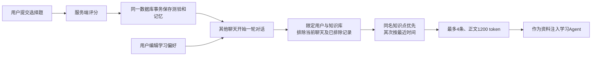

# 学习记忆：当前实现与面试说明

2026-09-19。参考 [TechSpar](https://github.com/AnnaSuSu/TechSpar) 提交 `3eb45d82770dbf4ce21549f82ddea0762aec5f3e`，只借鉴业务思路，没有复制源码。参考仓库在系统临时目录 `studypilot-reference-techspar`，不属于 StudyPilot Git。

## 参考项目做了什么

主要参考 [profile-service.ts](https://github.com/AnnaSuSu/TechSpar/blob/3eb45d82770dbf4ce21549f82ddea0762aec5f3e/packages/core/src/profile/profile-service.ts) 与 [model.ts](https://github.com/AnnaSuSu/TechSpar/blob/3eb45d82770dbf4ce21549f82ddea0762aec5f3e/packages/core/src/profile/model.ts)。它在面试复盘后提取强弱项与行为观察，合并到用户画像，再供后续训练使用。另有语义匹配、记忆时间衰减、SM-2 复习安排和跨领域规律归纳；用户可以否定归纳出的规律。当前代码并不是简单套一个 mem0 服务，不能仅凭 GitHub topic 判断实现。

StudyPilot 采用其中“记录 → 跨会话读取 → 用户可纠正”的路径。当前是选择题学习场景，评分已经结构化，先直接记下事实，不增加一次 LLM 画像推断或新的向量库。

## 两种记忆，三个存储职责

| 内容 | 保存位置 | 用途 |
|---|---|---|
| 用户明确填写的讲解偏好、长期目标、总开关 | `learning_preferences`，按 user_id | 所有课程可参考的用户自述 |
| 当次知识点、答对数/总题数、错题题干与来源、原会话、时间、是否纳入 | `learning_memories`，按 user_id + knowledge_base_id | 当前课程跨聊天参考的练习记录 |
| 完整消息与题目/答案、当前聊天摘要 | 原有 `learning_turns` / `quizzes` / `learning_contexts` | 原始历史、业务结果、当前会话上下文；不被长期记忆代替 |

例如第一次学习“FIFO 页面置换”时，2 题答对 1 题，错题是“增加物理页框一定能减少缺页吗？”。保存的是这次结果与题干，不推断“用户能力差”或“永远不理解 Belady”。用户填写“先用类比，再解释原理”。在另一个 OS 聊天中学习 FIFO 时，模型会获得该偏好和这次测验记录，可以补充例子；数据库记录本身不保证生成质量提升。

## 写入、召回与纠正

- `LearningPersistenceService.saveQuizResultAndAdvance` 在评分事务里调用 `LearningMemoryService.recordQuiz`。事务失败时，评分与记忆一起回滚。
- `(user_id, quiz_id)` 唯一键使同一测验重复写入不增加记录，也不会重新启用用户排除的记录。不同测验分别保留，没有用主题标题合并分数。
- `LearningConversationGateway` 每轮读取偏好与记忆。SQL 按用户、知识库、`included=true` 和“非当前 session”过滤，再按主题**字符串相等**和时间排序；不是语义召回，不保证同义主题被优先匹配。
- 最多取 4 条候选，序列化后用现有 TokenCounter 计算正文预算；超预算的整条跳过。预算通过 `study-agent.learning.memory.context-tokens` 与 `recall-limit` 配置。
- 偏好是用户自述；题目标准答案来自模型，历史记录不是人工鉴定的能力画像。Prompt 要求只在相关时参考，当前用户要求优先，不能改变阶段和工具权限。
- 页面可排除或重新纳入单条记录；不删除原聊天。关闭总开关后不再写新记录，也不再注入偏好和历史；重新开启不会自动补录关闭期间或升级前的测验。
- 排除/关闭只控制之后的注入。先前生成的回答和已有会话上下文不会追溯擦除。

## 接口和入口

侧栏“学习记忆”独立页面，展示当前课程最近 50 条记录，可跳回原聊天。

| 方法 | 路径 | 操作 |
|---|---|---|
| GET / PUT | `/api/learning-memory/preferences` | 读取/保存当前用户偏好和开关 |
| GET | `/api/learning-memory?knowledgeBaseId=...` | 最近测验记录 |
| PUT | `/api/learning-memory/{id}/inclusion?knowledgeBaseId=...` | 请求体 `{"included":false}` 排除记录；true 恢复 |

身份来自现有服务端用户上下文；服务端验证知识库归属，更新记录同时限定 user_id 和 knowledge_base_id。公网演示使用网关固定的共享用户，不能当成多用户账号系统。

## 可以怎么讲

> 我把短期上下文和长期学习记忆分开：会话摘要负责当前对话连续性；长期记忆保存用户明确填写的偏好，以及已提交测验的结构化观察。测验与记忆在同一事务提交，按测验唯一键防重复；新聊天限定用户和课程召回，控制条数和 token。用户可以关闭或排除记录。初版不再调用模型推断画像，减少额外费用，也避免把一次错题固化成能力标签。

这轮完成源码与前后端构建，没有重跑课程、模型实验或浏览器验收。后端重启后 Flyway 应用 V19；需要新提交一次测验才有首条自动记忆。尚未量化个性化回答效果。
